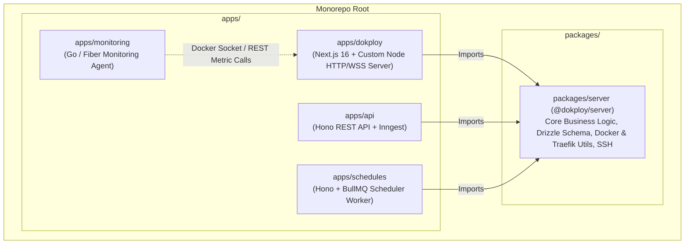
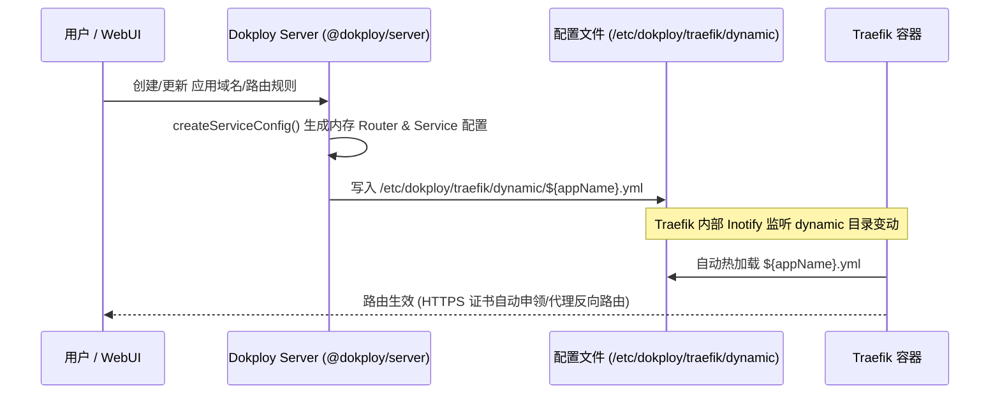
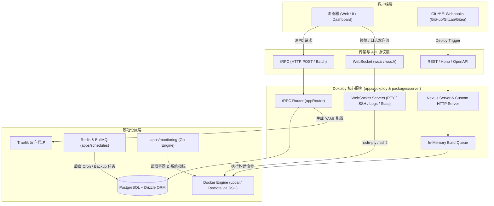

# 01. Dokploy 总体架构与技术栈分析

针对 Dokploy 项目的总体架构、技术栈选型、基础设施交互机制与系统数据流，进行全方位的深入剖析。

---

## 1. 项目总体架构与组件拆分

Dokploy 采用 **PNPM Monorepo**（配合 `pnpm-workspace.yaml`）架构管理整个代码库，代码清晰拆分为前端应用/微服务层（`apps/`）与核心共享业务包（`packages/`）。

### 1.1 `apps/` 目录微服务拆分与职责

1. **`apps/dokploy`（主控制台应用与 API 服务）**
   - **职责**：整个 Dokploy 的核心控制台。采用 Next.js 16 (React 19) + 自定义 Node.js HTTP/WebSocket 服务器 (`apps/dokploy/server/server.ts`)。
   - **关键功能**：
     - 托管管理前端 Dashboard。
     - 绑定多路 WebSocket 服务器，处理实时部署日志、容器终端（PTY/SSH）、容器日志过滤、Docker 实时 Stats 监控。
     - 运行本地部署队列 Worker (`startDeploymentWorker`)。
     - 负责系统初始化（Traefik 目录创建、网络初始化、Cron/Schedules 激活）。

2. **`apps/api`（轻量级 REST API 服务）**
   - **职责**：基于 Hono 框架运行在 4000 端口，集成 **Inngest**（Serverless / 后台任务编排引擎），用于响应对外 REST API 与异步 Workflow 调度。

3. **`apps/schedules`（后台定时任务与备份调度服务）**
   - **职责**：基于 Hono 框架运行在 4001 端口，结合 **BullMQ + ioredis + Drizzle ORM**。
   - **关键功能**：专门负责处理数据库定时备份、S3 Volume 卷备份、系统日志/指标定期清理等后台 Cron 任务。

4. **`apps/monitoring`（Go 语言高性能监控 Agent）**
   - **职责**：采用 **Go 语言 (Golang)** + **Fiber** 框架编写的轻量独立监控组件。
   - **关键功能**：
     - 直接与宿主机 Linux `/proc` 系统及 Docker Daemon 通信，按间隔采集主机 CPU/内存/磁盘/网络及各 Docker 容器的运行指标。
     - 提供 `/metrics` 与 `/metrics/containers` 接口供 Web 端或后端拉取展示，自带指标超限报警及 SQLite/Postgres 历史保留清理逻辑。

### 1.2 `packages/` 共享包职责

1. **`packages/server` (`@dokploy/server`)**
   - **职责**：Dokploy 的核心业务逻辑与基础设施抽象层，为 `apps/dokploy`、`apps/api`、`apps/schedules` 提供统一的底座。
   - **核心模块**：
     - **`db/`**：Postgres 连接池与 **Drizzle ORM** 数据库 Schema（包含 `application`, `compose`, `postgres`, `domain`, `server`, `user` 等 40+ 张表）。
     - **`auth/`**：基于 **Better-Auth** 的认证配置（支持 API Key、SSO、SCIM 扩展）。
     - **`utils/traefik/`**：Traefik 动态 YAML 配置文件生成器 (`application.ts`, `middleware.ts`)。
     - **`utils/docker/`**：Docker Client 自动检测与 `dockerode` 实例初始化 (`constants/index.ts`)。
     - **`utils/process/execAsync.ts`**：本地与远程 SSH 命令执行封装 (`execAsync`, `execAsyncRemote`)。

---

## 2. 前后端技术栈详析

| 层级 | 技术/框架 | 选型说明与优势 |
| :--- | :--- | :--- |
| **前端框架** | Next.js 16 (React 19) | 采用 Turbopack，提供 Server/Client Component 混合渲染与 API 路由能力。 |
| **UI 库与组件** | Tailwind CSS v4 + shadcn/ui | Radix UI 原子无样式组件 + Tailwind 样式，响应式且高度自定义。 |
| **终端与代码编辑** | XTerm.js (`@xterm/xterm`) + CodeMirror | `xterm` 提供类原生 SSH 终端体验；CodeMirror (`@uiw/react-codemirror`) 用于 Docker Compose YAML/JSON 高亮编辑。 |
| **状态管理与 RPC** | TanStack React Query v5 + **tRPC** v11 | 零 API 类型声明，前后端共享 TypeScript 类型，编译期保证接口契约一致。 |
| **表单与校验** | React Hook Form + **Zod** | 强类型表单校验与联动。 |
| **后端运行时** | Node.js 24+ (TS) + Go (Golang) | Node.js 处理主要业务逻辑与 WebSocket；Go 语言处理低开销、高频度的系统指标采集。 |
| **API 协议** | **tRPC**, **tRPC-OpenAPI**, **Hono REST**, **WebSocket** | 1. 内部 Dashboard 使用 tRPC。 2. 通过 `@dokploy/trpc-openapi` 自动导出 `openapi.json` 生成 Swagger API 文档。 3. 轻量服务使用 Hono REST。 4. 实时日志与 PTY 交互使用原生 Node `ws`。 |
| **数据库与 ORM** | PostgreSQL + **Drizzle ORM** (`drizzle-orm`) | `postgres.js` 驱动，使用 Drizzle 声明式 Schema (`drizzle-kit` 负责 Migration)。比 Prisma 更轻量、零 Overhead、生成 SQL 更直观。 |
| **身份认证** | **Better-Auth** (`better-auth`) | 替代传统 Auth 方案，内置支持 API Keys, SSO (OIDC/SAML), SCIM 统一身份管理。 |

---

## 3. 核心基础设施交互机制

### 3.1 与 Docker Daemon / Docker Socket 通信

1. **本地 Docker 实例自动探测** (`packages/server/src/constants/index.ts`)：
   - 依次检测 `DOKPLOY_DOCKER_HOST`、`DOCKER_HOST` 环境变量、Rancher Desktop Socket (`~/.rd/docker.sock`) 及标准 Unix Socket (`/var/run/docker.sock`)。
   - 使用 `dockerode` 库建立 Node.js 与 Docker Engine API 的直接通信。
2. **多节点 / 远程服务器容器管理** (`packages/server/src/utils/process/execAsync.ts`)：
   - 对于 Dokploy 管理的远程 Server 节点，通过 `ssh2` 模块建立 SSH 隧道，使用 `execAsyncRemote` 远程调用远程节点上的 Docker CLI (`docker build`, `docker compose`, `docker swarm`)。

### 3.2 与 Traefik 反向代理交互与动态配置生成

Dokploy 采用 Traefik 的 **File Provider** 动态配置模式，避免因修改路由规则而频繁重启 Traefik 容器：

- **配置文件存储路径**：默认为 `/etc/dokploy/traefik/dynamic/${appName}.yml` (`packages/server/src/constants/index.ts`)。
- **远程节点同步**：对远程 Node，Dokploy 将 YAML 内容进行 Base64 编码，通过 SSH 命令 `echo "$encoded" | base64 -d > /etc/dokploy/traefik/dynamic/${appName}.yml` 写入远程节点，实现配置秒级生效。

### 3.3 任务队列与定时任务 (Scheduler & Monitoring)

1. **部署任务队列 (Deployment Queue)** (`apps/dokploy/server/queues/queueSetup.ts`)：
   - **单机自托管模式**：采用自定义的 `InMemoryQueue`，基于应用/ Compose ID 进行分组 FIFO 排队，并使用 `resolveBuildsConcurrency` 限制并发构建数，防止服务器内存爆满。
   - **云端模式**：可配置异步后台直接执行。
2. **定时调度服务 (Schedules Service)** (`apps/schedules`)：
   - 基于 **BullMQ + ioredis + node-schedule**，独立进程处理高可靠的 Cron 任务（如数据库自动备份、S3 卷备份、清理沉淀部署日志等）。
3. **监控 Agent (Monitoring)** (`apps/monitoring`)：
   - Go Fiber 独立进程通过 Background Ticker（默认每数秒）采集宿主机 `/proc` 与 Docker Stats 写入数据库，检查 Threshold 告警，并通过 REST 接口实时暴露给 UI 的 Recharts 图表。

---

## 4. 系统数据流与通讯模型

